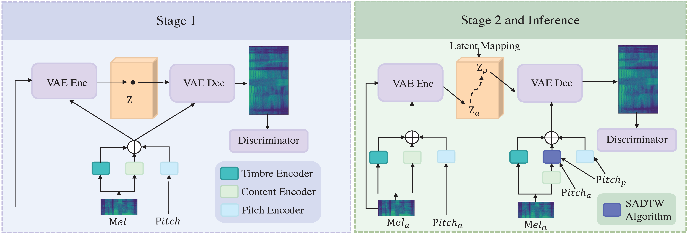
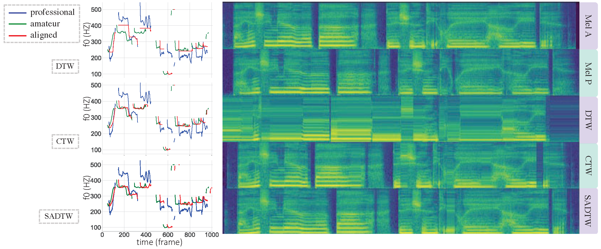

# Learning the Beauty in Songs: Neural Singing Voice Beautifier

Jinglin Liu, Chengxi Li, Yi Ren, Zhiying Zhu, Zhou Zhao

Zhejiang University

ACL 2022 Main conference

## Abstract

We are interested in a novel task, singing voice beautifying (SVB). Given the singing voice of an amateur singer, SVB aims to improve the intonation and vocal tone of the voice, while keeping the content and vocal timbre. Current automatic pitch correction techniques are immature, and most of them are restricted to intonation but ignore the overall aesthetic quality. Hence, we introduce Neural Singing Voice Beautifier (NSVB), the first generative model to solve the SVB task, which adopts a conditional variational autoencoder as the backbone and learns the latent representations of vocal tone. In NSVB, we propose a novel time-warping approach for pitch correction: Shape-Aware Dynamic Time Warping (SADTW), which ameliorates the robustness of existing time-warping approaches, to synchronize the amateur recording with the template pitch curve. Furthermore, we propose a latent-mapping algorithm in the latent space to convert the amateur vocal tone to the professional one. Extensive experiments on both Chinese and English songs demonstrate the effectiveness of our methods in terms of both objective and subjective metrics. 

## Singing Audio Samples
Note that the singer in the testing data could **not** be found in the training data.
### Chinese
0. 世界比你想象中朦胧, shì jiè bǐ nǐ xiǎng xiàng zhōng méng lóng
    <table style='width: 100%;'>
        <thead>
        <tr>
            <th></th>
            <th>GT Professional</th>
            <th>GT Amateur</th>
            <th>baseline</th>
            <th>NSVB</th>
        </tr>
        </thead>
        <tbody>
        <tr>
            <th scope="row">wav</th>
            <td><audio controls="" ><source src="resources/audio/Chinese/gt_p/19.wav" type="audio/wav"></audio></td>
            <td><audio controls="" ><source src="resources/audio/Chinese/gt_a/19.wav" type="audio/wav"></audio></td>
            <td><audio controls="" ><source src="resources/audio/Chinese/baseline/19.wav" type="audio/wav"></audio></td>
            <td><audio controls="" ><source src="resources/audio/Chinese/NSVB/19.wav" type="audio/wav"></audio></td>
        </tr>
    </tbody>
    </table>
1. 不会一场空, bú huì yī cháng kōng
    <table style='width: 100%;'>
        <thead>
        <tr>
            <th></th>
            <th>GT Professional</th>
            <th>GT Amateur</th>
            <th>baseline</th>
            <th>NSVB</th>
        </tr>
        </thead>
        <tbody>
        <tr>
            <th scope="row">wav</th>
            <td><audio controls="" ><source src="resources/audio/Chinese/gt_p/18.wav" type="audio/wav"></audio></td>
            <td><audio controls="" ><source src="resources/audio/Chinese/gt_a/18.wav" type="audio/wav"></audio></td>
            <td><audio controls="" ><source src="resources/audio/Chinese/baseline/18.wav" type="audio/wav"></audio></td>
            <td><audio controls="" ><source src="resources/audio/Chinese/NSVB/18.wav" type="audio/wav"></audio></td>
        </tr>
    </tbody>
    </table>
2. 不是天晴就会有彩虹, bú shì tiān qíng jiù huì yǒu cǎi hóng
    <table style='width: 100%;'>
        <thead>
        <tr>
            <th></th>
            <th>GT Professional</th>
            <th>GT Amateur</th>
            <th>baseline</th>
            <th>NSVB</th>
        </tr>
        </thead>
        <tbody>
        <tr>
            <th scope="row">wav</th>
            <td><audio controls="" ><source src="resources/audio/Chinese/gt_p/21.wav" type="audio/wav"></audio></td>
            <td><audio controls="" ><source src="resources/audio/Chinese/gt_a/21.wav" type="audio/wav"></audio></td>
            <td><audio controls="" ><source src="resources/audio/Chinese/baseline/21.wav" type="audio/wav"></audio></td>
            <td><audio controls="" ><source src="resources/audio/Chinese/NSVB/21.wav" type="audio/wav"></audio></td>
        </tr>
    </tbody>
    </table>

3. 要如何再搜索, yào rú hé zài sōu suǒ
    <table style='width: 100%;'>
        <thead>
        <tr>
            <th></th>
            <th>GT Professional</th>
            <th>GT Amateur</th>
            <th>baseline</th>
            <th>NSVB</th>
        </tr>
        </thead>
        <tbody>
        <tr>
            <th scope="row">wav</th>
            <td><audio controls="" ><source src="resources/audio/Chinese/gt_p/1.wav" type="audio/wav"></audio></td>
            <td><audio controls="" ><source src="resources/audio/Chinese/gt_a/1.wav" type="audio/wav"></audio></td>
            <td><audio controls="" ><source src="resources/audio/Chinese/baseline/1.wav" type="audio/wav"></audio></td>
            <td><audio controls="" ><source src="resources/audio/Chinese/NSVB/1.wav" type="audio/wav"></audio></td>
        </tr>
    </tbody>
    </table>

4. 也许未来遥远在光年之外, yě xǔ wèi lái yáo yuǎn zài guāng nián zhī wài
    <table style='width: 100%;'>
        <thead>
        <tr>
            <th></th>
            <th>GT Professional</th>
            <th>GT Amateur</th>
            <th>baseline</th>
            <th>NSVB</th>
        </tr>
        </thead>
        <tbody>
        <tr>
            <th scope="row">wav</th>
            <td><audio controls="" ><source src="resources/audio/Chinese/gt_p/2.wav" type="audio/wav"></audio></td>
            <td><audio controls="" ><source src="resources/audio/Chinese/gt_a/2.wav" type="audio/wav"></audio></td>
            <td><audio controls="" ><source src="resources/audio/Chinese/baseline/2.wav" type="audio/wav"></audio></td>
            <td><audio controls="" ><source src="resources/audio/Chinese/NSVB/2.wav" type="audio/wav"></audio></td>
        </tr>
    </tbody>
    </table>

5. 足够抵挡天旋地转, zú gòu dǐ dǎng tiān xuán dì zhuàn
    <table style='width: 100%;'>
        <thead>
        <tr>
            <th></th>
            <th>GT Professional</th>
            <th>GT Amateur</th>
            <th>baseline</th>
            <th>NSVB</th>
        </tr>
        </thead>
        <tbody>
        <tr>
            <th scope="row">wav</th>
            <td><audio controls="" ><source src="resources/audio/Chinese/gt_p/3.wav" type="audio/wav"></audio></td>
            <td><audio controls="" ><source src="resources/audio/Chinese/gt_a/3.wav" type="audio/wav"></audio></td>
            <td><audio controls="" ><source src="resources/audio/Chinese/baseline/3.wav" type="audio/wav"></audio></td>
            <td><audio controls="" ><source src="resources/audio/Chinese/NSVB/3.wav" type="audio/wav"></audio></td>
        </tr>
    </tbody>
    </table>

6. 虽然一刹花火, suī rán yī shā huā huǒ
    <table style='width: 100%;'>
        <thead>
        <tr>
            <th></th>
            <th>GT Professional</th>
            <th>GT Amateur</th>
            <th>baseline</th>
            <th>NSVB</th>
        </tr>
        </thead>
        <tbody>
        <tr>
            <th scope="row">wav</th>
            <td><audio controls="" ><source src="resources/audio/Chinese/gt_p/4.wav" type="audio/wav"></audio></td>
            <td><audio controls="" ><source src="resources/audio/Chinese/gt_a/4.wav" type="audio/wav"></audio></td>
            <td><audio controls="" ><source src="resources/audio/Chinese/baseline/4.wav" type="audio/wav"></audio></td>
            <td><audio controls="" ><source src="resources/audio/Chinese/NSVB/4.wav" type="audio/wav"></audio></td>
        </tr>
    </tbody>
    </table>

7. 从来也不觉得错, cóng lái yě bù jué dé cuò
    <table style='width: 100%;'>
        <thead>
        <tr>
            <th></th>
            <th>GT Professional</th>
            <th>GT Amateur</th>
            <th>baseline</th>
            <th>NSVB</th>
        </tr>
        </thead>
        <tbody>
        <tr>
            <th scope="row">wav</th>
            <td><audio controls="" ><source src="resources/audio/Chinese/gt_p/5.wav" type="audio/wav"></audio></td>
            <td><audio controls="" ><source src="resources/audio/Chinese/gt_a/5.wav" type="audio/wav"></audio></td>
            <td><audio controls="" ><source src="resources/audio/Chinese/baseline/5.wav" type="audio/wav"></audio></td>
            <td><audio controls="" ><source src="resources/audio/Chinese/NSVB/5.wav" type="audio/wav"></audio></td>
        </tr>
    </tbody>
    </table>
<!-- 9. 笑我给不起承诺, xiào wǒ gěi bù qǐ chéng nuò
    <table style='width: 100%;'>
        <thead>
        <tr>
            <th></th>
            <th>GT Professional</th>
            <th>GT Amateur</th>
            <th>baseline</th>
            <th>NSVB</th>
        </tr>
        </thead>
        <tbody>
        <tr>
            <th scope="row">wav</th>
            <td><audio controls="" ><source src="resources/audio/Chinese/gt_p/14.wav" type="audio/wav"></audio></td>
            <td><audio controls="" ><source src="resources/audio/Chinese/gt_a/14.wav" type="audio/wav"></audio></td>
            <td><audio controls="" ><source src="resources/audio/Chinese/baseline/14.wav" type="audio/wav"></audio></td>
            <td><audio controls="" ><source src="resources/audio/Chinese/NSVB/14.wav" type="audio/wav"></audio></td>
        </tr>
    </tbody>
    </table> -->
### English
0. I'm not angry anymore
    <table style='width: 100%;'>
        <thead>
        <tr>
            <th></th>
            <th>GT Professional</th>
            <th>GT Amateur</th>
            <th>baseline</th>
            <th>NSVB</th>
        </tr>
        </thead>
        <tbody>
        <tr>
            <th scope="row">wav</th>
            <td><audio controls="" ><source src="resources/audio/English/gt_p/21.wav" type="audio/wav"></audio></td>
            <td><audio controls="" ><source src="resources/audio/English/gt_a/21.wav" type="audio/wav"></audio></td>
            <td><audio controls="" ><source src="resources/audio/English/baseline/21.wav" type="audio/wav"></audio></td>
            <td><audio controls="" ><source src="resources/audio/English/NSVB/21.wav" type="audio/wav"></audio></td>
        </tr>
    </tbody>
    </table>
1. and the band won't play
    <table style='width: 100%;'>
        <thead>
        <tr>
            <th></th>
            <th>GT Professional</th>
            <th>GT Amateur</th>
            <th>baseline</th>
            <th>NSVB</th>
        </tr>
        </thead>
        <tbody>
        <tr>
            <th scope="row">wav</th>
            <td><audio controls="" ><source src="resources/audio/English/gt_p/1.wav" type="audio/wav"></audio></td>
            <td><audio controls="" ><source src="resources/audio/English/gt_a/1.wav" type="audio/wav"></audio></td>
            <td><audio controls="" ><source src="resources/audio/English/baseline/1.wav" type="audio/wav"></audio></td>
            <td><audio controls="" ><source src="resources/audio/English/NSVB/1.wav" type="audio/wav"></audio></td>
        </tr>
    </tbody>
    </table>
2. it's love
    <table style='width: 100%;'>
        <thead>
        <tr>
            <th></th>
            <th>GT Professional</th>
            <th>GT Amateur</th>
            <th>baseline</th>
            <th>NSVB</th>
        </tr>
        </thead>
        <tbody>
        <tr>
            <th scope="row">wav</th>
            <td><audio controls="" ><source src="resources/audio/English/gt_p/20.wav" type="audio/wav"></audio></td>
            <td><audio controls="" ><source src="resources/audio/English/gt_a/20.wav" type="audio/wav"></audio></td>
            <td><audio controls="" ><source src="resources/audio/English/baseline/20.wav" type="audio/wav"></audio></td>
            <td><audio controls="" ><source src="resources/audio/English/NSVB/20.wav" type="audio/wav"></audio></td>
        </tr>
    </tbody>
    </table>
3. the days grow long
    <table style='width: 100%;'>
        <thead>
        <tr>
            <th></th>
            <th>GT Professional</th>
            <th>GT Amateur</th>
            <th>baseline</th>
            <th>NSVB</th>
        </tr>
        </thead>
        <tbody>
        <tr>
            <th scope="row">wav</th>
            <td><audio controls="" ><source src="resources/audio/English/gt_p/2.wav" type="audio/wav"></audio></td>
            <td><audio controls="" ><source src="resources/audio/English/gt_a/2.wav" type="audio/wav"></audio></td>
            <td><audio controls="" ><source src="resources/audio/English/baseline/2.wav" type="audio/wav"></audio></td>
            <td><audio controls="" ><source src="resources/audio/English/NSVB/2.wav" type="audio/wav"></audio></td>
        </tr>
    </tbody>
    </table>

4. were beautiful like diamonds in the sky
    <table style='width: 100%;'>
        <thead>
        <tr>
            <th></th>
            <th>GT Professional</th>
            <th>GT Amateur</th>
            <th>baseline</th>
            <th>NSVB</th>
        </tr>
        </thead>
        <tbody>
        <tr>
            <th scope="row">wav</th>
            <td><audio controls="" ><source src="resources/audio/English/gt_p/7.wav" type="audio/wav"></audio></td>
            <td><audio controls="" ><source src="resources/audio/English/gt_a/7.wav" type="audio/wav"></audio></td>
            <td><audio controls="" ><source src="resources/audio/English/baseline/7.wav" type="audio/wav"></audio></td>
            <td><audio controls="" ><source src="resources/audio/English/NSVB/7.wav" type="audio/wav"></audio></td>
        </tr>
    </tbody>
    </table>

5. cause I wanna be better than I was before
    <table style='width: 100%;'>
        <thead>
        <tr>
            <th></th>
            <th>GT Professional</th>
            <th>GT Amateur</th>
            <th>baseline</th>
            <th>NSVB</th>
        </tr>
        </thead>
        <tbody>
        <tr>
            <th scope="row">wav</th>
            <td><audio controls="" ><source src="resources/audio/English/gt_p/14.wav" type="audio/wav"></audio></td>
            <td><audio controls="" ><source src="resources/audio/English/gt_a/14.wav" type="audio/wav"></audio></td>
            <td><audio controls="" ><source src="resources/audio/English/baseline/14.wav" type="audio/wav"></audio></td>
            <td><audio controls="" ><source src="resources/audio/English/NSVB/14.wav" type="audio/wav"></audio></td>
        </tr>
    </tbody>
    </table>

6. I'll fix you with my love
    <table style='width: 100%;'>
        <thead>
        <tr>
            <th></th>
            <th>GT Professional</th>
            <th>GT Amateur</th>
            <th>baseline</th>
            <th>NSVB</th>
        </tr>
        </thead>
        <tbody>
        <tr>
            <th scope="row">wav</th>
            <td><audio controls="" ><source src="resources/audio/English/gt_p/13.wav" type="audio/wav"></audio></td>
            <td><audio controls="" ><source src="resources/audio/English/gt_a/13.wav" type="audio/wav"></audio></td>
            <td><audio controls="" ><source src="resources/audio/English/baseline/13.wav" type="audio/wav"></audio></td>
            <td><audio controls="" ><source src="resources/audio/English/NSVB/13.wav" type="audio/wav"></audio></td>
        </tr>
    </tbody>
    </table>
7. we will glow in the dark turning dust to gold
    <table style='width: 100%;'>
        <thead>
        <tr>
            <th></th>
            <th>GT Professional</th>
            <th>GT Amateur</th>
            <th>baseline</th>
            <th>NSVB</th>
        </tr>
        </thead>
        <tbody>
        <tr>
            <th scope="row">wav</th>
            <td><audio controls="" ><source src="resources/audio/English/gt_p/9.wav" type="audio/wav"></audio></td>
            <td><audio controls="" ><source src="resources/audio/English/gt_a/9.wav" type="audio/wav"></audio></td>
            <td><audio controls="" ><source src="resources/audio/English/baseline/9.wav" type="audio/wav"></audio></td>
            <td><audio controls="" ><source src="resources/audio/English/NSVB/9.wav" type="audio/wav"></audio></td>
        </tr>
    </tbody>
    </table>
### Special cases on dialect
1. 我身骑白马, 走三关 gua sin khia peh be, tsau sam kuan
    <table style='width: 100%;'>
        <thead>
        <tr>
            <th></th>
            <th>GT Professional</th>
            <th>GT Amateur</th>
            <th>baseline</th>
            <th>NSVB</th>
        </tr>
        </thead>
        <tbody>
        <tr>
            <th scope="row">wav</th>
            <td><audio controls="" ><source src="resources/audio/Chinese/gt_p/16.wav" type="audio/wav"></audio></td>
            <td><audio controls="" ><source src="resources/audio/Chinese/gt_a/16.wav" type="audio/wav"></audio></td>
            <td><audio controls="" ><source src="resources/audio/Chinese/baseline/16.wav" type="audio/wav"></audio></td>
            <td><audio controls="" ><source src="resources/audio/Chinese/NSVB/16.wav" type="audio/wav"></audio></td>
        </tr>
    </tbody>
    </table>

2. 我改换素衣呦,回中原 gua kai uann soo i, hue tiong guan
    <table style='width: 100%;'>
        <thead>
        <tr>
            <th></th>
            <th>GT Professional</th>
            <th>GT Amateur</th>
            <th>baseline</th>
            <th>NSVB</th>
        </tr>
        </thead>
        <tbody>
        <tr>
            <th scope="row">wav</th>
            <td><audio controls="" ><source src="resources/audio/Chinese/gt_p/17.wav" type="audio/wav"></audio></td>
            <td><audio controls="" ><source src="resources/audio/Chinese/gt_a/17.wav" type="audio/wav"></audio></td>
            <td><audio controls="" ><source src="resources/audio/Chinese/baseline/17.wav" type="audio/wav"></audio></td>
            <td><audio controls="" ><source src="resources/audio/Chinese/NSVB/17.wav" type="audio/wav"></audio></td>
        </tr>
    </tbody>
    </table>
